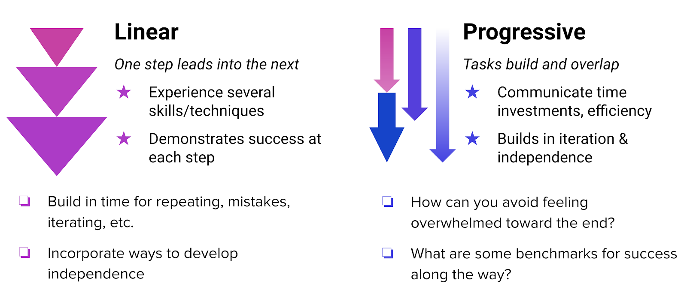

# Defining Mentorship in a Research Setting

## <mark style="color:purple;">Part 1: An Overview of Mentorship</mark>

At its core, the scientific enterprise is hallmarked by the propagation of knowledge from skilled scientist to research apprentice. Currently, and for most of modern scientific history, the value and success of this knowledge propagation is measured almost exclusively on the specific outcomes of scientific discovery -- i.e. elucidation of mechanism, publications, funding, or other project-focused themes. Despite being embedded in a system completely dependent on people training other people, there has been little focus on how we can most effectively build and nurture the human relationships required to conduct science.&#x20;

As our communities work toward creating a more inclusive scientific enterprise, we must do more to emphasize the sheer fact that science is a human endeavor. Through this set of materials, we hope to open up important discussions around mentorship among members of our scientific community. While there is no one best way to be an effective mentor, there are certain core expectations that can promote excellence in mentoring. By incorporating reflective mentoring practices into the academic framework, we can elevate the notion that science is indeed for everyone.

## <mark style="color:purple;">Establishing the Meaning of Mentorship</mark>

At its baseline, mentorship is a partnership between someone who is experienced in a given area, and someone who wishes to gain experience in said area. When we engage in mentorship, we are promoting the transfer of knowledge between individuals, and within organizations. The way in which we approach mentorship as a community sets the tone for institutional culture, and paves the way for sustaining and scaling the scientific enterprise. In deconstructing what it means to be an effective mentor, we can consider five essential elements, described below.

<figure><figcaption></figcaption></figure>

### <mark style="color:purple;">Assessment and Feedback</mark>

How do you know if you are doing a good job as a mentor? This is often the million dollar question as context, personalities, goals, and general capacity will dictate your mentorship strategy. However, learning how to assess your effectiveness as a mentor is key. Essential to this process is the ability to honestly reflect on how it is going, and make any necessary adjustments to help streamline your approach. But it isn’t just about assessing how you are doing -- as a mentor, you will also have to give feedback to your mentee so they, too, can reflect and iterate as needed.

### <mark style="color:purple;">**Providing Scientific and Career Guidance**</mark>

Becoming a member of the scientific community is more than just learning how to pipette. There is often a complicated roadmap for learning how to navigate the general operational functions of any given laboratory or equivalent scientific setting, as **** well as how one might be able to leverage a scientific experience for career marketability. As a mentor, you are charged with helping your mentee understand these aspects of the scientific landscape to the best of your ability. If you are not equipped to provide this level of guidance, this is ok, but it is important that you identify a person or group who might be able to fill this role so that your mentee can maximize their learning experience (and perhaps you will learn something new, too).

### <mark style="color:purple;">Supporting the Whole Person</mark>

It is always important to recognize that science is done by people, and there are all sorts of contexts that have a direct influence on who we are, how we think, and how we work. When signing on to become a mentor, it is important to approach your mentee through an empathetic lens. By allowing yourself to think more fully about where your mentee might be coming from, you open up the channels for more efficient and effective communication, while also supporting mentee learning.

### <mark style="color:purple;">**Technical Training**</mark>

Conducting science requires a skillset that is not easily acquired from a textbook -- you learn by doing (and failing). As a mentor, one of your roles will be to teach your mentee the technical aspects of conducting science. This will look very different from lab to lab, bench to bench, or even project to project. Don’t forget to budget enough time for technical skills acquisition. For example, it might take your mentee 4x longer to set up an experiment that you can typically fly through.

### <mark style="color:purple;">Project Management</mark>

How do you achieve scientific goals with your mentee in the time you have together? This is where project management comes into play. Before starting any project, it is important to map out what you want to achieve, the steps you will take to get there, and consistent check-ins to assess how things are going. Our 2-4-6 Adaptive Action plan is a good way to think about project management in the context of your mentoring partnership.
